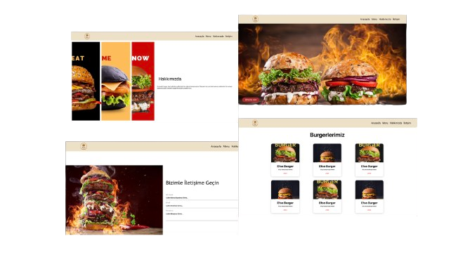

# 🍔 Burger Website Design 

• Responsive  Burger Website Design.
 
• Made using Node.js.
 
• There is a page for contact transition.
 
• There is a menu page.
 
• There is a page with an About Me section that provides information about the site.

 
